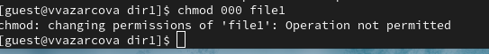
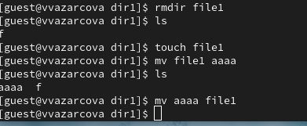
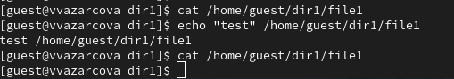

---
## Author
author:
  name: Азарцова Вероника Валерьевна
  degrees: Студентка ФФМиЕН РУДН группы НКАбд-01-24
  email: 1132246751@rudn.ru
  affiliation:
    - name: Российский университет дружбы народов
      country: Российская Федерация
      postal-code: 117198
      city: Москва
      address: ул. Миклухо-Маклая, д. 6
## Title
title: Лабораторная работа №4
subtitle: Преподаватель Кулябов Дмитрий Сергеевич, д.ф.-м.н, профессор кафедры теории вероятностей и кибербезопасности
license: CC BY
date: today
date-format: "YYYY-MM-DD" # Example: 2025-09-06
slide_level: 2
incremental: false
---

# Вводная часть

## Докладчик

:::::::::::::: {.columns align=center}
::: {.column width="70%"}

  * Азарцова Вероника Валерьевна
  * Студентка группы НКАбд-01-24
  * Факультета физико-математических и естественных наук
  * Российский университет дружбы народов им. П. Лумумбы
  * [1132246751@rudn.ru](mailto:1132246751@rudn.ru)
  * <https://vvazarcova.github.io/ru/>

:::
::: {.column width="30%"}

:::
::::::::::::::

## Выполнение лабораторной работы

1. От имени пользователя guest определяем расширенные атрибуты файла /home/guest/dir1/file1 командой lsattr /home/guest/dir1/file1.

2. Устанавливаем командой chmod 600 file1на файл file1 права, разрешающие чтение и запись для владельца файла ([рис. @fig-1]).

{#fig-1 width=70%}

## Выполнение лабораторной работы

3. Попробуем установить на файл /home/guest/dir1/file1 расширенный атрибут a от имени пользователя guest: сhattr +a /home/guest/dir1/file1. В ответ получаем отказ от выполнения операции. ([рис. @fig-2]).

{#fig-2 width=70%}

## Выполнение лабораторной работы

4. Зайдем на третью консоль с правами администратора. Попробуем установить расширенный атрибут a на файл /home/guest/dir1/file1 от имени суперпользователя: chattr +a /home/guest/dir1/file1 ([рис. @fig-3]).

{#fig-3 width=70%}

## Выполнение лабораторной работы

5. От пользователя guest проверим правильность установления атрибута: lsattr /home/guest/dir1/file1

6. Выполним дозапись в файл file1 слова «test» командой echo "test" /home/guest/dir1/file1. После этого выполним чтение файла file1 командой cat /home/guest/dir1/file1. Убедимся что слово test было успешно записано в file1 ([рис. @fig-4]).

{#fig-4 width=70%}

## Выполнение лабораторной работы

7. Попробуем удалить файл file1 либо стереть имеющуюся в нём информацию командой echo "abcd" > /home/guest/dirl/file1. Попробуем переименовать файл ([рис. @fig-7]).

{#fig-5 width=70%}

## Выполнение лабораторной работы

8. Попробуем с помощью команды chmod 000 file1 установить на файл file1 права, например, запрещающие чтение и запись для владельца файла. На снимке экрана видно результат (Отказ).([рис. @fig-6]).

{#fig-6 width=70%}

## Выполнение лабораторной работы

9. Снимаем расширенный атрибут a с файла /home/guest/dirl/file1 от имени суперпользователя командой chattr -a /home/guest/dir1/file1. Повторяем операции, которые вам ранее не удавалось выполнить. ([рис. @fig-7]).

{#fig-7 width=70%}

## Выполнение лабораторной работы

Повторяем операции, которые вам ранее не удавалось выполнить. Результат виден на снимке экрана ([рис. @fig-8]).

{#fig-8 width=70%}

## Выполнение лабораторной работы

10. Повторяю действия по шагам, заменив атрибут «a» атрибутом «i». В последствии дозаписать информацию в файл так же не удается. ([рис. @fig-9]).

{#fig-9 width=70%}

## Заключение

# Выводы

Если вам понравилось - посмотрите остальные мои презентации! 

Rutube, VK Video: vvazarcova
