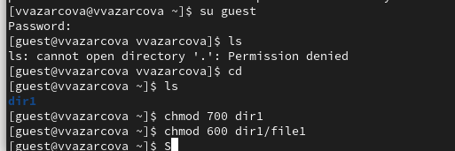
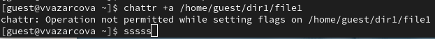
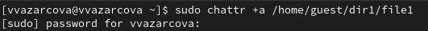
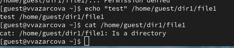
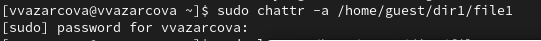

---
## Author
author:
  name: Азарцова Вероника Валерьевна
  degrees: Студент 2 курса бакалавриата ФФМиЕН НКАбд-01-24
  email: 1132246751@rudn.ru
  affiliation:
    - name: Российский университет дружбы народов
      country: Российская Федерация
      postal-code: 117198
      city: Москва
      address: ул. Миклухо-Маклая, д. 6

## Title
title: "Отчет"
subtitle: "Лабораторная работа №4"
license: "CC BY"
---

# Цель работы

Целью данной работы является получение практических навыков работы в консоли с расширенными
атрибутами файлов.

# Задание

1. Поработать с атрибутом "a"

2. Поработать с атрибутом "i"

3. Сравнить и сделать выводы.

# Теоретическое введение

# Теоретическое введение

**Права доступа** определяют, какие действия конкретный пользователь может или не может совершать с определенным файлами и каталогами. С помощью разрешений можно создать надежную среду — такую, в которой никто не может поменять содержимое ваших документов или повредить системные файлы. [1]

**Расширенные атрибуты файлов Linux** представляют собой пары имя:значение, которые постоянно связаны с файлами и каталогами, подобно тому как строки окружения связаны с процессом. Атрибут может быть определён или не определён. Если он определён, то его значение может быть или пустым, или не пустым. [2]

Расширенные атрибуты дополняют обычные атрибуты, которые связаны со всеми inode в файловой системе (т. е., данные stat(2)). Часто они используются для предоставления дополнительных возможностей файловой системы, например, дополнительные возможности безопасности, такие как списки контроля доступа (ACL), могут быть реализованы через расширенные атрибуты. [3]

*Установить атрибуты:*

- chattr filename

*Значения:*

- chattr +a # только добавление. Удаление и переименование запрещено;

- chattr +A # не фиксировать данные об обращении к файлу

- chattr +c # сжатый файл

- chattr +d # неархивируемый файл

- chattr +i # неизменяемый файл

- chattr +S # синхронное обновление

- chattr +s # безопасное удаление, (после удаления место на диске переписывается нулями)

- chattr +u # неудаляемый файл

- chattr -R # рекурсия

*Просмотреть атрибуты:*

- lsattr filename

*Опции:*

- lsattr -R # рекурсия

- lsattr -a # вывести все файлы (включая скрытые)

- lsattr -d # не выводить содержимое директории

# Выполнение лабораторной работы

1. От имени пользователя guest определяем расширенные атрибуты файла /home/guest/dir1/file1 командой lsattr /home/guest/dir1/file1.

2. Устанавливаем командой chmod 600 file1на файл file1 права, разрешающие чтение и запись для владельца файла ([рис. @fig-1]).

{#fig-1 width=70%}

3. Попробуем установить на файл /home/guest/dir1/file1 расширенный атрибут a от имени пользователя guest: сhattr +a /home/guest/dir1/file1. В ответ получаем отказ от выполнения операции. ([рис. @fig-2]).

{#fig-2 width=70%}

4. Зайдем на третью консоль с правами администратора. Попробуем установить расширенный атрибут a на файл /home/guest/dir1/file1 от имени суперпользователя: chattr +a /home/guest/dir1/file1 ([рис. @fig-3]).

{#fig-3 width=70%}

5. От пользователя guest проверим правильность установления атрибута: lsattr /home/guest/dir1/file1

6. Выполним дозапись в файл file1 слова «test» командой echo "test" /home/guest/dir1/file1. После этого выполним чтение файла file1 командой cat /home/guest/dir1/file1. Убедимся что слово test было успешно записано в file1 ([рис. @fig-4]).

{#fig-4 width=70%}

7. Попробуем удалить файл file1 либо стереть имеющуюся в нём информацию командой echo "abcd" > /home/guest/dirl/file1. Попробуем переименовать файл ([рис. @fig-7]).

{#fig-5 width=70%}

8. Попробуем с помощью команды chmod 000 file1 установить на файл file1 права, например, запрещающие чтение и запись для владельца файла. На снимке экрана видно результат (Отказ).([рис. @fig-6]).

{#fig-6 width=70%}

9. Снимаем расширенный атрибут a с файла /home/guest/dirl/file1 от имени суперпользователя командой chattr -a /home/guest/dir1/file1. Повторяем операции, которые вам ранее не удавалось выполнить. ([рис. @fig-7]).

{#fig-7 width=70%}

Повторяем операции, которые вам ранее не удавалось выполнить. Результат виден на снимке экрана ([рис. @fig-8]).

{#fig-8 width=70%}

10. Повторяю действия по шагам, заменив атрибут «a» атрибутом «i». В последствии дозаписать информацию в файл так же не удается. ([рис. @fig-9]).

{#fig-9 width=70%}

# Выводы

Подводя выводы проведенной работе, мне удалось повысить свои навыки использования интерфейса командой строки (CLI), познакомившись на примерах с тем, как используются основные и расширенные атрибуты при разграничении доступа. Я имела возможность связать теорию дискреционного разделения доступа (дискреционная политика безопасности) с её реализацией на практике в ОС Linux. Опробовала действие на практике расширенных атрибутов «а» и «i».

# Список литературы{.unnumbered}

1. Медведовский И.Д., Семьянов П.В., Платонов В.В. Атака через Internet. — НПО "Мир и семья-95",  1997. — URL: http://bugtraq.ru/library/books/attack1/index.html

2. Медведовский И.Д., Семьянов П.В., Леонов Д.Г.  Атака на Internet. — Издательство ДМК, 1999. — URL: http://bugtraq.ru/library/books/attack/index.html

3. Запечников С. В. и др. Информационн~пасность открытых систем. Том 1. — М.: Горячаая линия -Телеком, 2006.

::: {#refs}
:::
