---
## Author
author:
  name: Азарцова Вероника Валерьевна
  degrees: Студентка ФФМиЕН РУДН группы НКАбд-01-24
  email: 1132246751@rudn.ru
  affiliation:
    - name: Российский университет дружбы народов
      country: Российская Федерация
      postal-code: 117198
      city: Москва
      address: ул. Миклухо-Маклая, д. 6
## Title
title: Лабораторная работа №5
subtitle: Преподаватель Кулябов Дмитрий Сергеевич, д.ф.-м.н, профессор кафедры теории вероятностей и кибербезопасности
license: CC BY
date: today
date-format: "YYYY-MM-DD" # Example: 2025-09-06
slide_level: 2
incremental: false
---

# Вводная часть

## Докладчик

:::::::::::::: {.columns align=center}
::: {.column width="70%"}

  * Азарцова Вероника Валерьевна
  * Студентка группы НКАбд-01-24
  * Факультета физико-математических и естественных наук
  * Российский университет дружбы народов им. П. Лумумбы
  * [1132246751@rudn.ru](mailto:1132246751@rudn.ru)
  * <https://vvazarcova.github.io/ru/>

:::
::: {.column width="30%"}


:::
::::::::::::::

## Теоретическое введение

1. Дополнительные атрибуты файлов Linux

В Linux существует три основных вида прав — право на чтение (read), запись (write) и выполнение (execute), а также три категории пользователей, к которым они могут применяться — владелец файла (user), группа владельца (group) и все остальные (others). Но, кроме прав чтения, выполнения и записи, есть еще три дополнительных атрибута. [@u]

**Sticky bit**

Используется в основном для каталогов, чтобы защитить в них файлы. В такой каталог может писать любой пользователь. Но, из такой директории пользователь может удалить только те файлы, владельцем которых он является. Примером может служить директория /tmp, в которой запись открыта для всех пользователей, но нежелательно удаление чужих файлов.

## Теоретическое введение

**SUID (Set User ID)**

Атрибут исполняемого файла, позволяющий запустить его с правами владельца. В Linux приложение запускается с правами пользователя, запустившего указанное приложение. Это обеспечивает дополнительную безопасность т.к. процесс с правами пользователя не сможет получить доступ к важным системным файлам, которые принадлежат пользователю root.

**SGID (Set Group ID)**

Аналогичен suid, но относиться к группе. Если установить sgid для каталога, то все файлы созданные в нем, при запуске будут принимать идентификатор группы каталога, а не группы владельца, который создал файл в этом каталоге.

# Выполнение лабораторной работы

## Создание программы

1. Осуществляется вход от имени пользователя guest ([рис. @fig-1]).

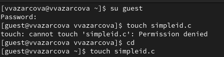{#fig-1 width=70%}

## Создание программы

2. Создание файла simpleid.c и запись в файл кода ([рис. @fig-2]).

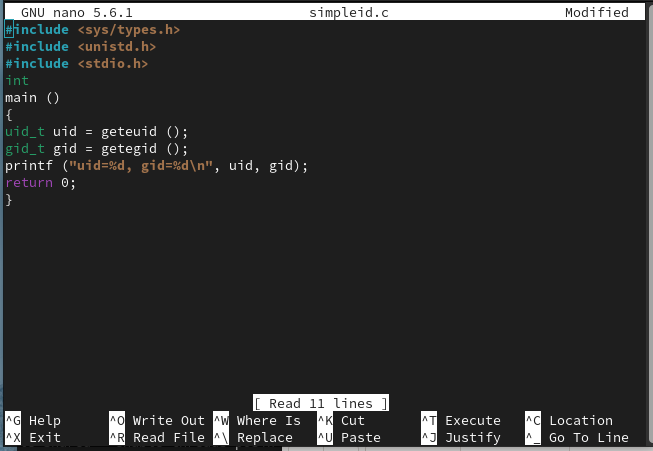{#fig-2 width=70%}

## Создание программы

Код программы:


``` C++
#include <sys/types.h>
#include <unistd.h>
#include <stdio.h>
int
main ()
{
uid_t uid = geteuid ();
gid_t gid = getegid ();
printf ("uid=%d, gid=%d\n", uid, gid);
return 0;
}
```

## Создание программы

3. Компилирую файл, проверяю, что он скомпилировался 

4. Запускаю исполняемый файл. В выводе файла выписыны номера пользоватея и групп.

5. Запускаю id. От вывода при вводе id, они отличаются только тем, что информации меньше. На снимке экрана для краткости предоставлены последние 3 действия (пункт 3-5) ([рис. @fig-3]).

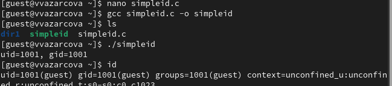{#fig-3 width=70%}

## Создание программы

6. Создание, запись в файл и компиляция файла simpleid2.c. ([рис. @fig-4]).

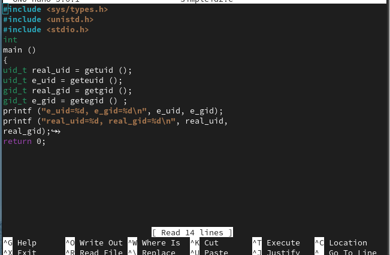{#fig-4 width=70%}

## Создание программы

Код программы:

``` C++
#include <sys/types.h>
#include <unistd.h>
#include <stdio.h>
int
main ()
{
uid_t real_uid = getuid ();
uid_t e_uid = geteuid ();
gid_t real_gid = getgid ();
gid_t e_gid = getegid () ;
printf ("e_uid=%d, e_gid=%d\n", e_uid, e_gid);
printf ("real_uid=%d, real_gid=%d\n", real_uid,
real_gid);
return 0;
}
```

## Создание программы

7. Запускаю программу ([рис. @fig-5]).

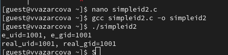{#fig-5 width=70%}

## Создание программы

8. Использую команды chown и chmod ([рис. @fig-6]).

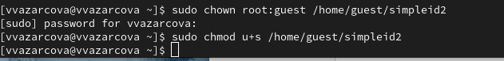{#fig-6 width=70%}

## Создание программы

9. Пояснение - с помощью chown изменяю владельца файла на суперпользователя, с помощью chmod изменяю права доступа 

10. Выполняю проверку правильности установки новых атрибутов и смены владельца файла simpleid2. ([рис. @fig-7]).

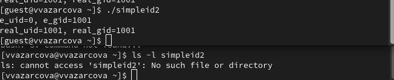{#fig-7 width=70%}

## Создание программы

11. Сравнение вывода программы и команды id, наша команда снова вывела только ограниченное количество информации ([рис. @fig-8]).

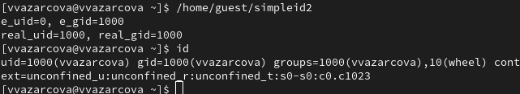{#fig-8 width=70%}

## Создание программы

12. Проделываю то же самое относительно SetGID-бита. 

13. Создание и компиляция файла readfile.c ([рис. @fig-9]).

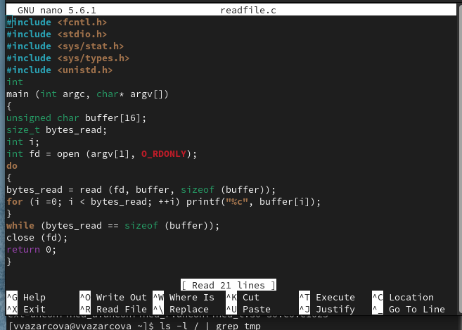{#fig-9 width=70%}

## Создание программы

Код программы:

```C++
#include <fcntl.h>
#include <stdio.h>
#include <sys/stat.h>
#include <sys/types.h>
#include <unistd.h>
int
main (int argc, char* argv[])
{
unsigned char buffer[16];
size_t bytes_read;
int i;
int fd = open (argv[1], O_RDONLY);
do
{
bytes_read = read (fd, buffer, sizeof (buffer));
for (i =0; i < bytes_read; ++i) printf("%c", buffer[i]);
}
while (bytes_read == sizeof (buffer));
close (fd);
return 0;
}
```
## Создание программы

14. Компилирую файл.

15. Снова от имени суперпользователи меняю владельца файла readfile. Далее меняю права доступа так, чтобы пользователь guest не смог прочесть содержимое файла.

16. Проверка чтения файл от имени пользователя guest. Прочесть файл не удается - пункты 15, 16 ([рис. @fig-10]).

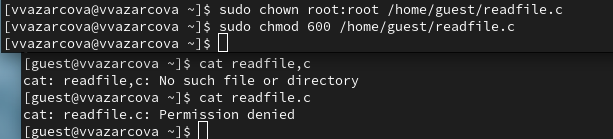{#fig-10 width=70%}

## Создание программы

17. Попытка прочесть тот же файл с помощью программы readfile. ([рис. @fig-11]).

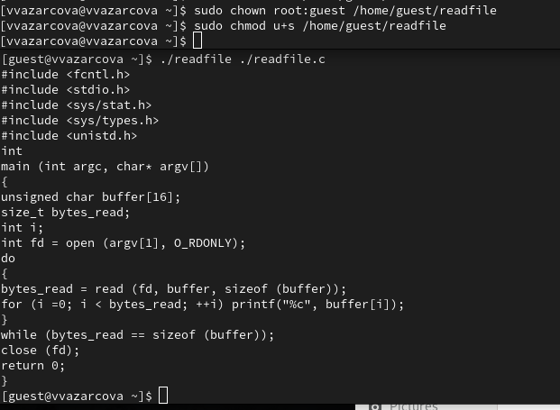{#fig-11 width=70%}

## Создание программы

18. Попытка прочесть файл `/etc/shadow` с помощью программы ([рис. @fig-12]).

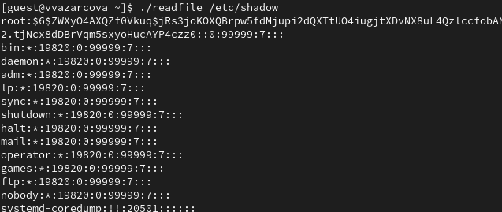{#fig-12 width=70%}

## Создание программы


19. Пробуем прочесть эти же файлы от имени суперпользователя и чтение файлов проходит успешно.

## Исследование Sticky-бита

1. Проверяем папку tmp на наличие атрибута Sticky, т.к. в выводе есть буква t, то атрибут установлен ([рис. @fig-13]).

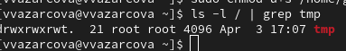{#fig-13 width=70%}

## Исследование Sticky-бита

2. Вхожу под именем пользователя guest2 с третьей консоли для удобства.

3. От имени пользователя guest создаю файл с текстом, добавляю права на чтение и запись для других пользователей ([рис. @fig-14]).

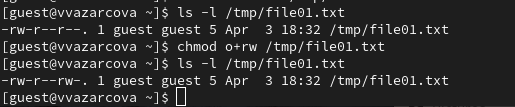{#fig-14 width=70%}

## Исследование Sticky-бита

4. Вхожу в систему от имени пользователя guest2, от его имени могу прочитать файл file01.txt ([рис. @fig-15]).

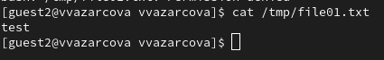{#fig-15 width=70%}

## Исследование Sticky-бита

5. Перезаписать информацию в нем не могу ([рис. @fig-16]).

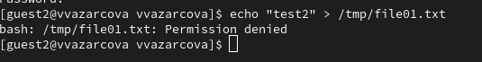{#fig-16 width=70%}

## Исследование Sticky-бита

6. По cat очевидно видно что ничего не поменялось. 

7. Также невозможно добавить в файл file01.txt новую информацию от имени пользователя guest2 ([рис. @fig-17]).

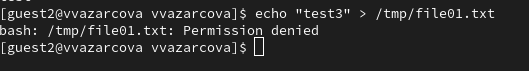{#fig-17 width=70%}

## Исследование Sticky-бита

8. По cat очевиндо снова видно что ничего не поменялось.

9. Далее пробуем удалить файл, снова получаем отказ ([рис. @fig-18]).

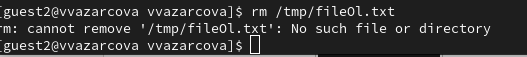{#fig-18 width=70%}

## Исследование Sticky-бита## Исследование Sticky-бита

10. От имени суперпользователя снимаем с директории атрибут Sticky 

11. Покидаем режим суперпользователя командой exit.

12. Проверяем, что атрибут действительно снят - он снят. Для краткости на снимке экрана последние 3 действия - пункт 10, 11, 12 ([рис. @fig-19]).

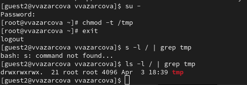{#fig-19 width=70%}

## Исследование Sticky-бита

13. Далее был выполнен повтор предыдущих действий ([рис. @fig-20]).

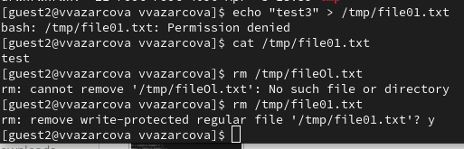{#fig-20 width=70%}

14. По результатам без Sticky-бита запись в файл и дозапись в файл осталась невозможной, зато удаление файла прошло успешно.

## Исследование Sticky-бита

15. Возвращение директории tmp атрибута t от имени суперпользователя простыми уже знакомыми командами.

## Заключение

Если вам понравилось - посмотрите остальные мои презентации! 

Rutube: vvazarcova
