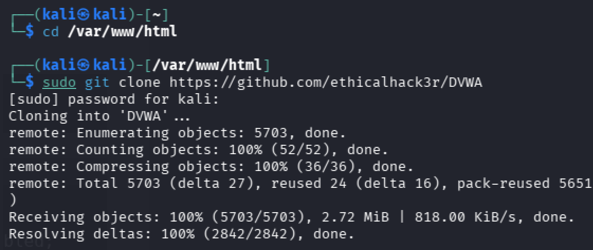
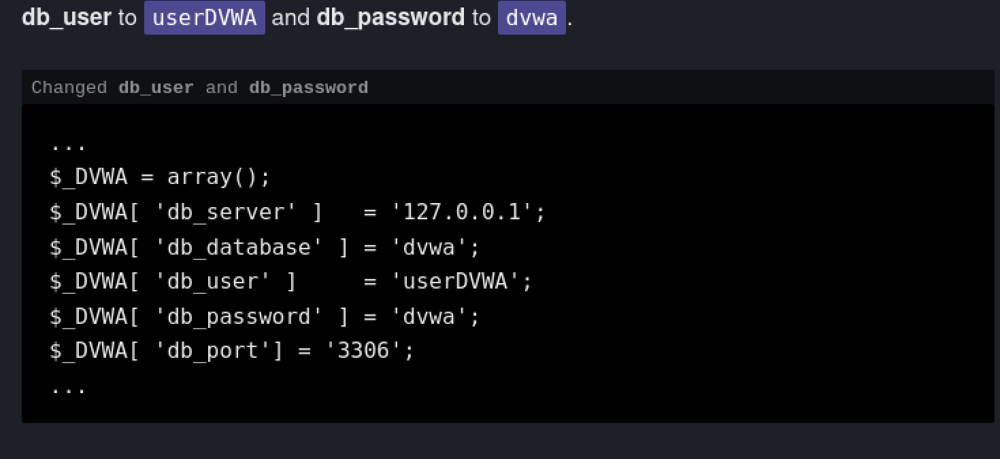
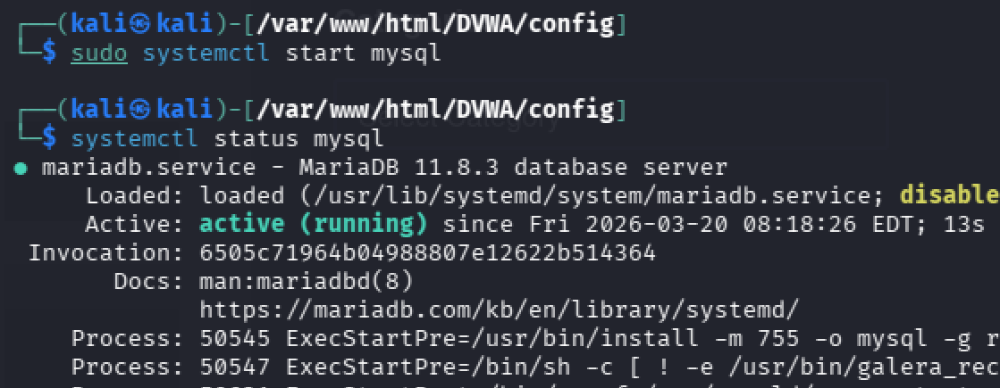
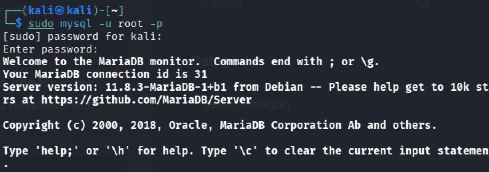
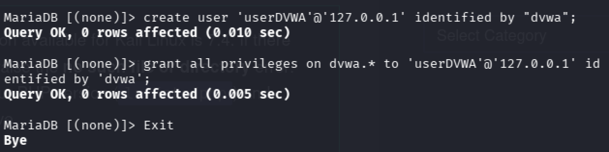
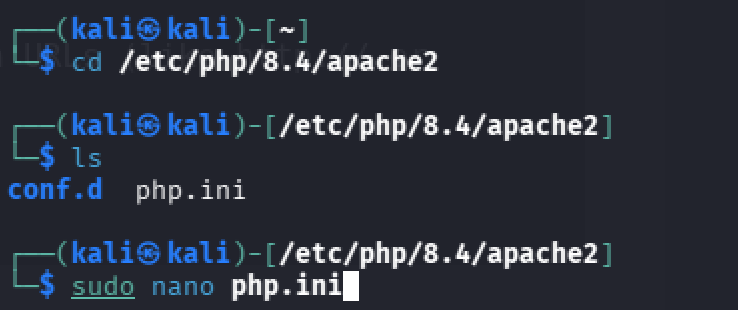
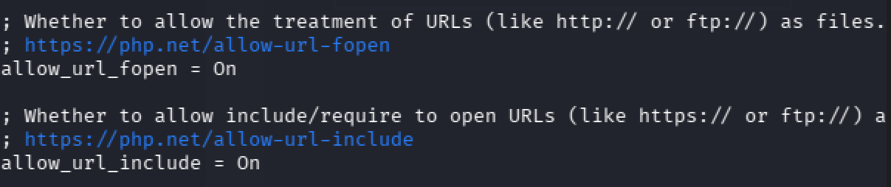
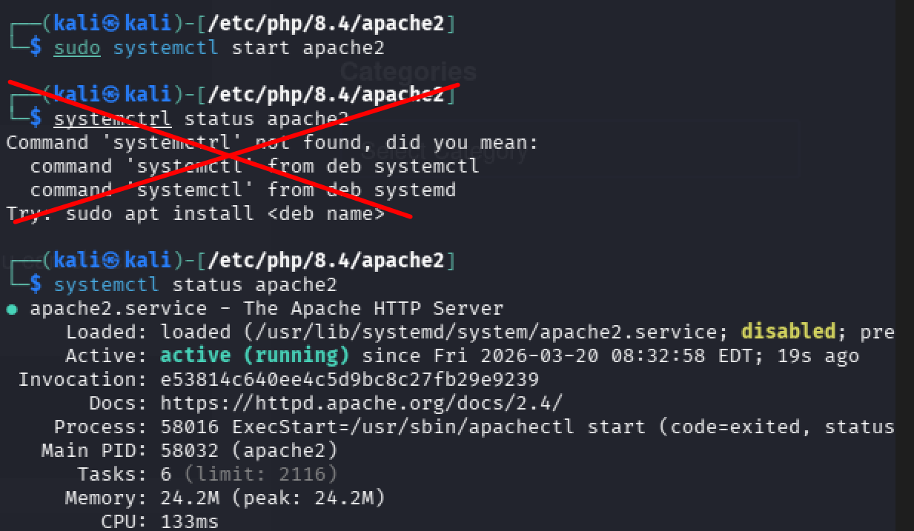
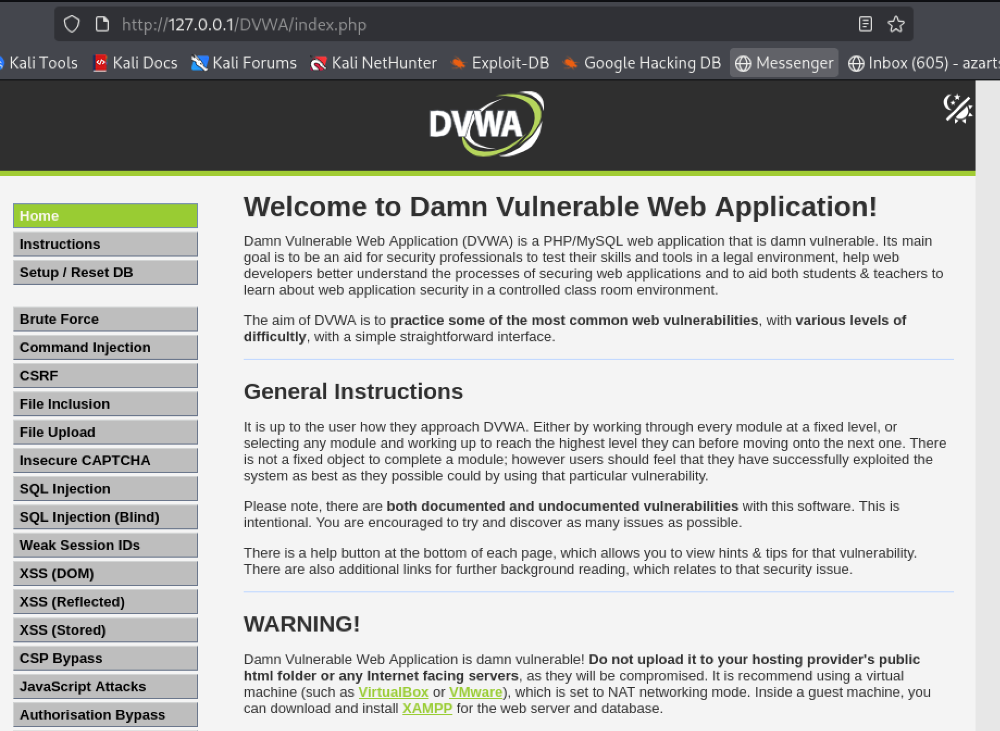

---
## Author
author:
  name: Азарцова Вероника Валерьевна
  degrees: Студентка ФФМиЕН РУДН группы НКАбд-01-24
  email: 1132246751@rudn.ru
  affiliation:
    - name: Российский университет дружбы народов
      country: Российская Федерация
      postal-code: 117198
      city: Москва
      address: ул. Миклухо-Маклая, д. 6
## Title
title: Инд. проект, этап 2
subtitle: Преподаватель Кулябов Дмитрий Сергеевич, д.ф.-м.н, профессор кафедры теории вероятностей и кибербезопасности
license: CC BY
date: today
date-format: "YYYY-MM-DD" # Example: 2025-09-06
slide_level: 2
incremental: false
---

# Вводная часть

## Докладчик

:::::::::::::: {.columns align=center}
::: {.column width="70%"}

  * Азарцова Вероника Валерьевна
  * Студентка группы НКАбд-01-24
  * Факультета физико-математических и естественных наук
  * Российский университет дружбы народов им. П. Лумумбы
  * [1132246751@rudn.ru](mailto:1132246751@rudn.ru)
  * <https://vvazarcova.github.io/ru/>

:::
::: {.column width="30%"}

:::
::::::::::::::

## Теоретическое введение

Damn Vulnerable Web Application (DVWA) - намеренно уязвимое веб-приложение, созданное для профессионалов и студентов, обучающихся в области безопасности, разработчиков и команд dev-ops, чтобы они могли использовать свои инструменты тестирования, усилить конфигурации и убедиться, что защита ужесточена.

# Выполнение этапа

## Настройка DVWA и датабазы

1. Скачиваю репозиторий DVWA с помощью git clone в каталоге со всеми файлами localhost ([рис. @fig-1]).

{#fig-1 width=70%}

## Настройка DVWA и датабазы

2. Выдаю папке DVWA все разрешения с помощью команды sudo chmod -R 777 DVWA, и затем перехожу в её папку конфиг, где копирую файл конфигурации на всякий случай, а затем с помощью nano меняю в нем имя пользователя и пароль на следующее: [рис. @fig-3].

{#fig-3 width=70%}

## Настройка DVWA и датабазы

3. Запускаю сервис mysql и проверяю его статус, чтобы убедиться, что он запущен ([рис. @fig-4]).

{#fig-4 width=70%}

## Настройка DVWA и датабазы

4. Логинюсь в систему для менеджмента датабаз MariaDB, которая уже стоит на системе Kali Linux ([рис. @fig-5]).

{#fig-5 width=70%}

## Настройка DVWA и датабазы

5. Создаю нового пользователя и задаю ему пароль, используя имя и пароль которые я задала в config.inc.php в шаге 2, а так же выдаю ему полные полномочия над датабазой dvwa ([рис. @fig-6]).

{#fig-6 width=70%}

## Настройка Apache

1. Перехожу в каталог апачи и использую nano чтобы изменить файл с настройками ([рис. @fig-7]).

{#fig-7 width=70%}

## Настройка Apache

2. Меняю конфигурацию allow_url_fopen и allow_url_include на On, сохраняю файл и возвращаюсь в терминал ([рис. @fig-8]).

{#fig-8 width=70%}

## Настройка Apache

3. Запускаю апачи и проверяю его статус (всё работает) ([рис. @fig-9]).

{#fig-9 width=70%}

## Настройка Apache

Теперь просто ввожу http://127.0.0.1/DVWA/setup.php в мой браузер (Мозилла) и ввожу имя пользователя и пароль (по умолчанию: admin, password), и после этого сразу же загружается страница моего сайта DVWA ([рис. @fig-10]).

{#fig-10 width=70%}

Все задачи этапа выполнены.

## Контрольный вопрос

Контрольный вопрос к данному этапу:

Можно ли ставить DVWA на свой публичный веб сервер?

Ответ: Нет, нельзя, т.к. оно специально разработано с огромным количеством уязвимостей, что ставит в опасность сервер. Поэтому мы устанавливаем его и работаем с ним на виртуальной машине.

## Заключение

Если вам понравилось - посмотрите остальные мои презентации! 

Rutube: vvazarcova
